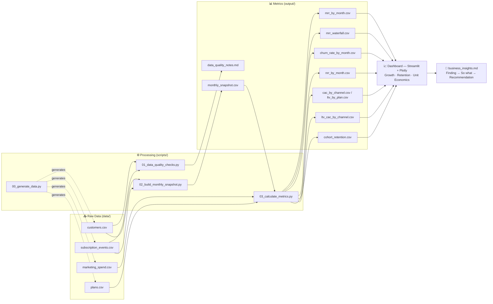
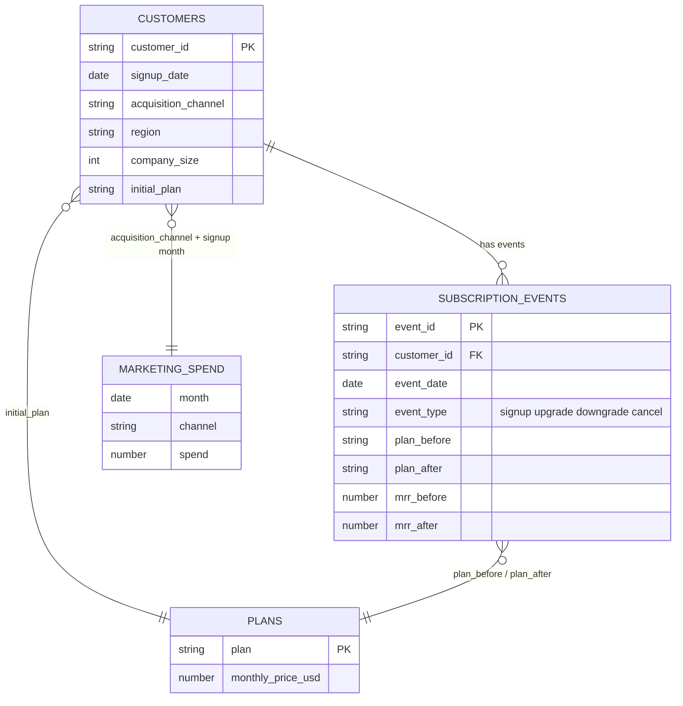
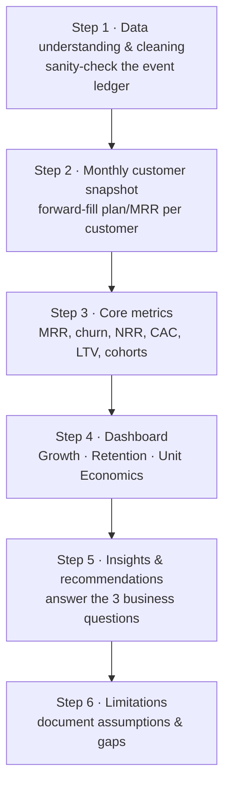

# TaskFlow — SaaS Metrics Analysis

**MRR · Churn · NRR · LTV:CAC — reconstructed from a raw billing event ledger**


Personal ITBA portfolio project. TaskFlow is a **fictional** project-management
SaaS with 24 months of synthetic subscription data (Jan 2023 – Dec 2024),
shaped like a real Stripe/billing export. The goal is to reconstruct core
SaaS financial metrics from a raw event ledger — no metric is handed to you
pre-computed — and turn them into business recommendations, the same
workflow a Business Analyst runs on real billing data.

**Headline result:** MRR grew from $1,327 to $93,204 over 24 months, but NRR
averages 98.7% — growth is acquisition-driven, not retention-driven. Full
reasoning in [`output/business_insights.md`](output/business_insights.md).

---

## Table of contents

- [Business questions](#business-questions)
- [Key findings](#key-findings)
- [Tech stack](#tech-stack)
- [Architecture](#architecture)
- [Data model](#data-model)
- [Repository structure](#repository-structure)
- [Pipeline / build plan](#pipeline--build-plan)
- [Key formulas](#key-formulas-reference)
- [Getting started](#getting-started)
- [Status](#status)
- [Known limitations](#known-limitations)

---

## Business questions

This project must produce a defensible answer to each of these:

1. **Health** — Is TaskFlow growing in a healthy way, or leaking revenue?
2. **Channel quality** — Which acquisition channel brings the best-quality customers (highest LTV:CAC)?
3. **Strategy** — Should the company prioritize acquisition (new customers) or retention (reducing churn) next quarter?

---

## Key findings

Full write-up with Finding → So what → Recommendation for each business
question: [`output/business_insights.md`](output/business_insights.md).

| Question | Answer |
|---|---|
| Is growth healthy? | Mostly no. MRR grew 70x ($1,327 → $93,204) but NRR averages **98.7%** — the existing customer base nets **−$9,186** over 24 months once churn and contraction are netted against expansion. Growth is 100% acquisition-fed. |
| Best acquisition channel? | **Referral**, at **28.7:1** LTV:CAC — 15x more efficient than **Paid Ads** (2.0:1), which is also the 2nd-largest spend channel. |
| Acquisition or retention next quarter? | **Retention.** Revenue churn (3.3%/mo) sits well below logo churn (8.3%/mo) — the leak is concentrated in low-value accounts, which is the cheapest segment to fix before spending more on acquisition. |

---

## Tech stack

| Layer | Tool | Purpose |
|---|---|---|
| Language | **Python 3.10+** | Data generation, transformation, metric calculations |
| Data wrangling | **pandas**, **NumPy** | Forward-fill snapshots, groupby aggregations, waterfall/cohort logic |
| Dates | **python-dateutil** | Month-boundary arithmetic (`relativedelta`) |
| Storage | **CSV** (flat files) | Event ledger + dimension tables — mirrors a raw billing export |
| Dashboard | **Streamlit + Plotly** *(or Power BI / Tableau Public)* | Interactive Growth / Retention / Unit Economics views |
| Docs | **Markdown** | Data dictionary, data-quality notes, business insights |

> The dashboard track is a choice, not a fixed dependency — build it in
> whichever of Streamlit/Plotly, Power BI, or Tableau Public best fits how
> you want to present it. `requirements.txt` includes the Python track.

---

## Architecture

End-to-end flow from raw ledger to business recommendation:



---

## Data model

The event ledger is the **source of truth** — MRR, churn, and NRR are all
derived from it, never read off a pre-built column.



A customer's **state in any given month** = their last event on or before
that month (forward-filled).

---

## Repository structure

```
taskflow-saas-metrics/
├── README.md                        you are here
├── requirements.txt                  Python dependencies
├── data/
│   ├── customers.csv                 customer dimension table        (5,142 rows)
│   ├── subscription_events.csv       event ledger — source of truth  (8,151 rows)
│   ├── marketing_spend.csv           monthly spend by channel        (120 rows)
│   ├── plans.csv                     plan pricing reference          (4 rows)
│   └── data_dictionary.md            full schema + known limitations
├── scripts/
│   ├── 00_generate_data.py           dataset generator (seeded, reproducible)
│   ├── 01_data_quality_checks.py     sanity-checks the ledger, writes data_quality_notes.md
│   ├── 02_build_monthly_snapshot.py  forward-fills plan/MRR per customer/month
│   └── 03_calculate_metrics.py       computes all 8 metric CSVs below
├── output/                           analysis results (CSVs, notes) — all generated
│   ├── data_quality_notes.md         6/6 checks passed
│   ├── monthly_snapshot.csv          32,681 customer-month rows
│   ├── mrr_by_month.csv
│   ├── mrr_waterfall.csv
│   ├── churn_rate_by_month.csv
│   ├── nrr_by_month.csv
│   ├── cac_by_channel.csv
│   ├── ltv_by_plan.csv
│   ├── ltv_cac_by_channel.csv
│   ├── cohort_retention.csv
│   └── business_insights.md          Finding → So what → Recommendation
└── dashboard/
    └── app.py                        Streamlit app — 3 views, run with `streamlit run dashboard/app.py`
```

---

## Pipeline / build plan

Run in order — each step depends on the previous step's output.



### Step 1 — Data understanding & cleaning
- Script: `scripts/01_data_quality_checks.py`
- Sanity-checks the event ledger: no duplicate signups per customer, no
  negative MRR values, all event_dates within Jan 2023–Dec 2024, at most
  one event per customer per month, no same-month signup+cancel, full
  referential integrity against `customers.csv`.
- Output: `output/data_quality_notes.md` — **6/6 checks passed**, ledger
  needs no cleaning before Step 2.

### Step 2 — Build the monthly customer snapshot
- Script: `scripts/02_build_monthly_snapshot.py`
- For every customer, forward-fills their plan/MRR state across every
  month from signup to Dec 2024 (or the month before they cancel), using
  the event ledger in `subscription_events.csv` and a `merge_asof`
  "last event on/before month M" join.
- Output: `output/monthly_snapshot.csv` — 32,681 rows, columns:
  `customer_id, month, plan, mrr, acquisition_channel`.
- Sanity check: **2,162** paying customers active in Dec 2024 — matches the
  README's target exactly.

### Step 3 — Core metrics
- Script: `scripts/03_calculate_metrics.py`
- Computes, saves each to its own CSV in `output/` (gross margin assumption: **80%**):

| File | Contents |
|---|---|
| `mrr_by_month.csv` | Total MRR per month |
| `mrr_waterfall.csv` | New / Expansion / Contraction / Churned MRR per month |
| `churn_rate_by_month.csv` | Logo churn % and revenue churn % |
| `nrr_by_month.csv` | Net Revenue Retention % |
| `cac_by_channel.csv` | `marketing_spend` / new customers, per channel per month |
| `ltv_by_plan.csv` | LTV = (ARPU × gross margin assumption) / churn rate — **state the gross margin assumption explicitly** (e.g. 80%), it's not in the data |
| `ltv_cac_by_channel.csv` | LTV:CAC ratio per channel |
| `cohort_retention.csv` | % of each signup-month cohort still active N months later |

### Step 4 — Dashboard
- App: `dashboard/app.py` (Streamlit + Plotly) — run with
  `streamlit run dashboard/app.py`.
- Three views, each reading directly from `output/*.csv`:
  - **Growth Overview** — MRR trend, MRR waterfall, headline KPIs
  - **Retention Health** — logo vs. revenue churn, NRR trend, cohort retention heatmap
  - **Unit Economics** — LTV:CAC by channel (vs. 3:1 benchmark), LTV/CAC by channel
- Colors are assigned by a fixed rule: each acquisition channel keeps one
  color across every chart on the page; the LTV:CAC chart uses status
  color (green/red) against the 3:1 benchmark line, not the channel colors.

### Step 5 — Insights & recommendations
- `output/business_insights.md`: Finding → So what → Recommendation,
  answering the [3 business questions](#business-questions) — see [Key findings](#key-findings) above for the short version.

### Step 6 — Limitations
- Documented in `output/business_insights.md`: no involuntary churn modeled,
  gross margin (80%) is an assumption, no macro/competitive effects, CAC is
  blended per channel (not per-campaign).

---

## Key formulas reference

```
MRR                 = sum(active subscription monthly value)
Churn Rate (%)      = churned customers in month / active customers at start of month
NRR (%)             = (Starting MRR + Expansion − Contraction − Churned MRR) / Starting MRR
                       (existing customers only — excludes New MRR)
CAC                 = marketing spend / new customers acquired, per channel/month
LTV                 = (ARPU × gross margin %) / monthly churn rate
LTV:CAC ratio       = LTV / CAC   (healthy benchmark: > 3:1)
```

---

## Getting started

```bash
# 1. Install dependencies
pip install -r requirements.txt

# 2. (Optional) Regenerate the synthetic dataset — seeded & reproducible
python scripts/00_generate_data.py

# 3. Data quality checks -> output/data_quality_notes.md
python scripts/01_data_quality_checks.py

# 4. Build the monthly customer snapshot -> output/monthly_snapshot.csv
python scripts/02_build_monthly_snapshot.py

# 5. Compute all 8 core metrics -> output/*.csv
python scripts/03_calculate_metrics.py

# 6. Launch the dashboard
streamlit run dashboard/app.py
```

---

## Status

- [x] Dataset generated (`data/`)
- [x] Step 1 — data quality notes (6/6 checks passed)
- [x] Step 2 — monthly snapshot (32,681 rows; sanity check matched exactly)
- [x] Step 3 — core metrics (all 8 files generated, waterfall reconciles to $0 diff)
- [x] Step 4 — dashboard (Streamlit + Plotly, 3 views)
- [x] Step 5 — insights (`output/business_insights.md`)
- [x] Step 6 — limitations (documented in `output/business_insights.md`)

---

## Known limitations

Intentional gaps in the synthetic dataset — discuss these in the final write-up:

- No seat-based/usage-based pricing — flat MRR per plan only.
- No refunds, failed payments, or involuntary churn (all cancels are voluntary).
- No macro/competitive shocks — churn and growth are driven only by plan, channel, and tenure.
- Gross margin isn't in the data — an assumption must be stated to calculate LTV.
